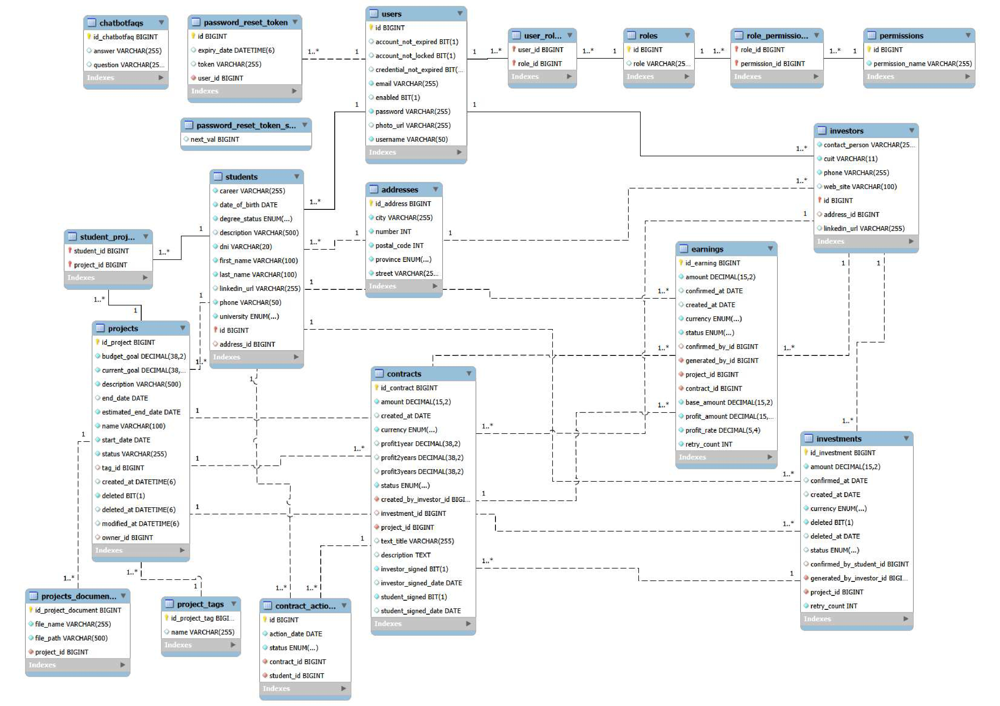

# 🤖 Plataforma de Inversores - Backend

**ProyPlus** es una plataforma backend robusta diseñada para conectar a **estudiantes universitarios** con ideas innovadoras y a **inversores** que buscan potenciar el talento emergente. El sistema gestiona todo el ciclo de vida de un proyecto, desde su creación y financiación hasta la liquidación de ganancias, incorporando funcionalidades avanzadas de **Inteligencia Artificial** para el análisis de riesgos, la categorización de proyectos y el soporte al usuario.

## 💡 Decisiones de Diseño y Justificaciones Técnicas

Esta sección detalla las decisiones clave de arquitectura y tecnología tomadas durante el desarrollo, demostrando un enfoque pragmático y orientado a resultados.

#### ¿Por qué una Arquitectura Monolítica en Capas?
Frente a una arquitectura de microservicios, se optó por un enfoque monolítico en capas por razones estratégicas. Dado el plazo de desarrollo de tres meses y la naturaleza del proyecto, esta decisión permitió:
- **Agilizar el Desarrollo**: Al tener una única base de código y un solo artefacto a desplegar, se redujo la complejidad operativa y se aceleró la implementación de nuevas funcionalidades.
- **Reducir la Complejidad Inicial**: Se evitaron los desafíos inherentes a los microservicios, como la comunicación entre servicios, el descubrimiento de servicios y la gestión de transacciones distribuidas.
- **Mantenibilidad Centralizada**: La estructura en capas (`controller`, `service`, `repository`) garantiza una separación de responsabilidades clara dentro del monolito, facilitando su mantenimiento y escalabilidad futura.

#### ¿Por qué JWT para la Seguridad?
La elección de **JSON Web Tokens (JWT)** para la gestión de sesiones fue deliberada para construir una API **stateless**.
- **Escalabilidad y Simplicidad**: Al no depender de una sesión en el servidor, la API puede escalar horizontalmente sin problemas. Una vez que el módulo de seguridad fue implementado, el resto del desarrollo pudo centrarse en la lógica de negocio sin preocuparse por la gestión de estado de las sesiones.
- **Independencia del Cliente**: Permite que cualquier tipo de cliente (web, móvil) interactúe con la API de forma estandarizada, simplemente incluyendo el token en las cabeceras.

#### ¿Por qué combinar Weka y Google Gemini?
Se reconoció que no existe una única herramienta de IA para todos los problemas, por lo que se adoptó un enfoque híbrido:
- **Weka para Análisis de Riesgo**: Para el análisis de riesgo, se necesitaba un modelo de Machine Learning clásico que pudiera ser entrenado con datos estructurados y numéricos. La librería **Weka** de Java, con su implementación de **Random Forest**, fue ideal. El diseño de la base de datos se realizó desde el inicio pensando en capturar las características necesarias para este modelo. El entrenamiento se realizó sobre un dataset de 5,000 registros ficticios (generados con un script de Python) que emulaban escenarios realistas, permitiendo al modelo aprender patrones complejos.
- **Google Gemini para Tareas de NLP**: Para el **etiquetado de proyectos** y el **chatbot**, se requerían capacidades avanzadas de procesamiento de lenguaje natural (NLP). Entrenar un modelo propio para estas tareas habría requerido enormes cantidades de datos y tiempo. **Google Gemini** permitió delegar esta complejidad, logrando resultados de alta calidad con un esfuerzo de implementación mínimo a través de *prompt engineering*.

#### ¿Por qué usar DTOs y el Patrón Mapper?
Inicialmente, la aplicación no utilizaba DTOs, pero se adoptó este patrón para mejorar la robustez y flexibilidad del código.
- **Desacoplamiento y Seguridad**: El uso de **Data Transfer Objects (DTOs)** y mappers (con MapStruct) crea una capa de abstracción entre la API y el modelo de datos interno. Esto evita exponer directamente las entidades JPA y previene problemas de seguridad y acoplamiento.
- **Flexibilidad de la API**: Permitió crear múltiples "vistas" de un mismo modelo de datos, adaptadas a las necesidades específicas de cada endpoint. Como se puede observar en el paquete `dto`, existen numerosas variantes de DTOs que surgieron para satisfacer requisitos concretos, algo que habría sido inviable utilizando únicamente las entidades del dominio.

## 🛡️ Consideraciones de Seguridad

La seguridad fue un pilar fundamental desde el inicio del desarrollo, implementando múltiples capas de protección:

- **Autenticación y Autorización con Spring Security**: Se utilizó Spring Security como framework principal. Aunque se evaluó Keycloak, se optó por Spring Security por la familiaridad con la tecnología y su capacidad para integrarse rápidamente.
- **Hashing de Contraseñas**: Todas las contraseñas de los usuarios se almacenan hasheadas utilizando el algoritmo **BCrypt**, implementado fácilmente a través de `BCryptPasswordEncoder`.
- **Protección de Endpoints a Nivel de Método**: Se utiliza la anotación `@PreAuthorize` para un control de acceso granular basado en roles (`ADMIN`, `STUDENT`, `INVESTOR`). Esto asegura que solo los usuarios con los privilegios adecuados puedan acceder a las funcionalidades.
- **Validación de Datos de Entrada**: Se emplea la anotación `@Valid` en los DTOs de los controladores para validar los datos de entrada. Esto protege la base de datos de información corrupta y previene vulnerabilidades básicas de inyección.
- **Manejo de Secretos**: Se asume que todas las credenciales sensibles (como claves de API y contraseñas de base de datos) deben ser gestionadas a través de variables de entorno o un sistema de gestión de secretos en un entorno de producción, y no deben estar hardcodeadas en el código.

## ✨ Buenas Prácticas y Patrones Aplicados

- **Manejo Centralizado de Excepciones**: Se implementó un `ControllerHandler` (`@RestControllerAdvice`) para interceptar todas las excepciones lanzadas por la aplicación. Esto permite centralizar la lógica de manejo de errores y devolver respuestas HTTP consistentes y bien formateadas, mejorando la experiencia del desarrollador del cliente. Además, se creó un conjunto de **excepciones de negocio personalizadas** (ej. `ProjectNotFoundException`, `UnauthorizedOperationException`) para un control de errores más semántico y legible.
- **Tareas Programadas (Scheduled Tasks)**: Se utilizó `@Scheduled` de Spring para crear tareas automáticas, como el `ProjectFundingScheduler`. Este componente se encarga de verificar periódicamente los proyectos cuya fecha límite de financiación ha expirado y no han alcanzado su meta, cambiando su estado a `NOT_FUNDED` de forma automática. Esto demuestra la capacidad de implementar lógica de negocio asíncrona y automatizada.
- **Gestión Multi-Moneda**: El sistema está diseñado para operar con múltiples divisas (ARS, EUR, USD, CNY). Para mantener la coherencia, todos los objetivos de financiación de los proyectos (`budgetGoal` y `currentGoal`) se almacenan y calculan en **USD**. Sin embargo, las inversiones y ganancias pueden realizarse en cualquiera de las monedas soportadas. El `CurrencyConversionService` se encarga de realizar las conversiones necesarias en tiempo real para actualizar el progreso de financiación de un proyecto de manera precisa, sin importar la moneda de la transacción.

## 🏛️ Arquitectura en Capas

El proyecto sigue una arquitectura multicapa clásica, lo que garantiza una clara separación de responsabilidades, alta cohesión y bajo acoplamiento entre los componentes.

- **Capa de Controladores (`controller`)**:
  - **Responsabilidad**: Es el punto de entrada de la aplicación. Recibe las peticiones HTTP, valida y deserializa los datos de entrada (DTOs), y delega la lógica de negocio a la capa de servicios.
  - **Flujo**: Mapea los endpoints (ej. `/api/projects`) a métodos específicos. Una vez que el servicio completa su trabajo, el controlador se encarga de serializar la respuesta y devolverla al cliente con el código de estado HTTP adecuado.

- **Capa de Servicios (`service`)**:
  - **Responsabilidad**: Contiene toda la lógica de negocio de la aplicación. Orquesta las operaciones, interactúa con múltiples repositorios si es necesario y realiza los cálculos o transformaciones de datos. Aquí residen los flujos de trabajo complejos, como la firma de un contrato o el análisis de riesgo.
  - **Flujo**: Un método de servicio (ej. `createContract`) recibe datos del controlador, interactúa con los repositorios para persistir o recuperar entidades, y puede llamar a otros servicios (ej. `MailService` para enviar notificaciones).

- **Capa de Repositorios (`repository`)**:
  - **Responsabilidad**: Es la capa de acceso a datos (DAO). Define las interfaces (extendiendo de `JpaRepository`) que Spring Data JPA implementa automáticamente para realizar operaciones CRUD (Crear, Leer, Actualizar, Borrar) sobre las entidades de la base de datos.
  - **Flujo**: Los servicios inyectan estas interfaces para interactuar con la base de datos de forma abstracta, sin necesidad de escribir consultas SQL manualmente para operaciones comunes.

- **Capa de Dominio/Modelo (`model`)**:
  - **Responsabilidad**: Contiene las entidades JPA que representan las tablas de la base de datos (ej. `Project`, `User`, `Contract`). Define la estructura de los datos, sus relaciones (`@OneToMany`, `@ManyToOne`, etc.) y restricciones.

- **Componentes Transversales**:
  - **Seguridad (`security`)**: Intercepta las peticiones para validar tokens JWT y aplicar reglas de autorización basadas en roles y permisos antes de que lleguen a los controladores.
  - **Mapeadores (`mapper`)**: Utiliza `MapStruct` para convertir de forma segura y automática entre DTOs (usados en la capa de controladores) y Entidades (usadas en la capa de servicios y repositorios).
  - **DTOs (`dto`)**: Data Transfer Objects que definen la "forma" de los datos que se envían y reciben a través de la API, actuando como un contrato con el cliente.
  - **Excepciones (`exception`)**: Clases personalizadas para manejar errores de negocio específicos (ej. `ProjectNotFoundException`), permitiendo un control de errores centralizado y respuestas HTTP claras.

## 🧱 Arquitectura y Tecnologías

- ✅ **Framework**: Spring Boot 3 (Java 17)
- ✅ **Base de Datos**: MySQL
- ✅ **Seguridad**: Spring Security, JWT
- ✅ **Machine Learning**: Weka (RandomForest)
- ✅ **IA Generativa**: Google Gemini
- ✅ **Gestión de Dependencias**: Maven
- ✅ **Documentación de API**: Postman

## ✨ Funcionalidades Destacadas con IA

### 1. Análisis de Riesgo de Inversión (Weka)

Antes de comprometer fondos, un inversor puede solicitar un análisis de riesgo para una propuesta de contrato. El sistema utiliza un modelo de **Random Forest** entrenado con datos históricos para predecir el nivel de riesgo (`BAJO`, `MEDIO`, `ALTO`).

#### ¿Cómo funciona?

1.  **Entrada de Datos**: El inversor proporciona el monto, la moneda y los porcentajes de rentabilidad que desea proponer.
2.  **Cálculo de Métricas Clave**: El servicio `RiskPredictionService` calcula en tiempo real un conjunto de características (features) para alimentar el modelo:
    - **Progreso del Proyecto**: Porcentaje de la meta de financiación ya alcanzado.
    - **Impacto de la Inversión**: Qué porcentaje de la meta total (o de lo que falta por financiar) representa la inversión propuesta.
    - **Ratio de Rentabilidad**: Compara la rentabilidad ofrecida con un promedio del mercado (8% anual).
    - **Ritmo de Financiación (Funding Pace)**: Mide si el proyecto está recaudando fondos más rápido o más lento de lo esperado en función del tiempo transcurrido.
3.  **Predicción del Modelo**: Estas métricas se introducen en el modelo de Weka, que devuelve una categoría de riesgo y un **puntaje de confianza**.
4.  **Informe Detallado**: Se genera un informe completo que incluye:
    - La categoría de riesgo y su confianza.
    - Un desglose de los **factores de análisis**, explicando cuáles son positivos o negativos y su **importancia relativa** en la predicción.
    - **Proyecciones de ganancias** a 1, 2 y 3 años.
    - Gráficos para visualizar la composición del riesgo.

### 2. Etiquetado Automático de Proyectos (Google Gemini)

Cuando un estudiante crea un proyecto, la descripción proporcionada es analizada por la IA para asignarle automáticamente una categoría.

#### ¿Cómo funciona?

1.  **Prompt Engineering**: El servicio `ProjectService` construye un *prompt* específico que instruye a Google Gemini para que actúe como un clasificador experto.
2.  **Contexto y Reglas**: El prompt contiene una lista cerrada de categorías (ej. `TECNOLOGÍA`, `SALUD Y BIENESTAR`, `IMPACTO SOCIAL`) y reglas estrictas para que la IA responda **únicamente** con una de las etiquetas de la lista.
3.  **Inferencia del Modelo**: Se envía la descripción del proyecto a Gemini, que devuelve la etiqueta más apropiada.
4.  **Asignación**: La etiqueta es asignada al proyecto, mejorando su visibilidad y capacidad de ser descubierto por inversores interesados en áreas específicas.

### 3. Chatbot de Soporte (Google Gemini)

La plataforma incluye un chatbot, **Proy+ Bot**, que responde a las preguntas frecuentes de los usuarios.

#### ¿Cómo funciona?

1.  **Base de Conocimiento**: El servicio `GeminiService` carga una base de conocimiento interna que contiene información detallada sobre el funcionamiento de la plataforma, los flujos de negocio y las políticas.
2.  **Instrucción de Sistema (System Instruction)**: Se crea un prompt de sistema que define la "personalidad" y las reglas del chatbot:
    - Debe presentarse como **Proy+ Bot**.
    - Debe responder basándose **exclusivamente** en la base de conocimiento proporcionada.
    - Tiene prohibido revelar que es un modelo de IA o que sigue instrucciones.
    - Si no conoce la respuesta, debe indicarlo de forma amable y profesional.
3.  **Interacción**: Cuando un usuario envía una consulta, esta se combina con la instrucción de sistema y se envía a Gemini, que genera una respuesta coherente y contextualizada.

## 🔄 Flujos de Negocio Detallados


### 1. Flujo de Creación y Financiación de un Proyecto

1.  **Creación (Estudiante)**: Un estudiante registra un proyecto, proporcionando detalles como nombre, descripción, meta de financiación y fechas. La IA le asigna una etiqueta. El proyecto inicia en estado `PENDING_FUNDING`.
2.  **Propuesta de Contrato (Inversor)**: Un inversor interesado crea un contrato (`DRAFT`), especificando monto, moneda y rentabilidades.
3.  **Negociación**: Ambas partes pueden editar los términos del contrato mientras esté en estado `DRAFT`.
4.  **Acuerdo y Bloqueo**: Cualquiera de las dos partes puede "dar el visto bueno" a los términos. Esto cambia el estado del contrato a `PARTIALLY_SIGNED` y lo **bloquea**, impidiendo futuras modificaciones. Este paso no es una firma, sino un acuerdo sobre los términos finales.
5.  **Ratificación del Contrato**:
    - Una vez bloqueado, ambas partes deben ratificar su acuerdo a través de la plataforma.
    - Cuando la primera parte confirma, el sistema lo registra.
    - Cuando la segunda parte confirma, el contrato cambia su estado a `SIGNED`.
6.  **Creación de la Inversión**: Al pasar a `SIGNED`, se crea automáticamente una **inversión** asociada en estado `IN_PROGRESS`, y se notifica al inversor para que realice la transferencia.
7.  **Transferencia y Confirmación**:
    - El inversor envía los fondos (fuera de la plataforma) y lo notifica en el sistema (`PENDING_CONFIRMATION`).
    - El estudiante verifica la recepción y confirma en la plataforma (`RECEIVED`). El `currentGoal` del proyecto se actualiza (convirtiendo el monto a USD si es necesario).
8.  **Cierre del Ciclo de Financiación**:
    - Si el proyecto alcanza su `budgetGoal`, pasa a `IN_PROGRESS`.
    - Si el tiempo de financiación expira sin alcanzar la meta, pasa a `NOT_FUNDED`, y se debe iniciar la devolución de los fondos.

### 2. Flujo de Cierre de Contrato y Generación de Ganancias

1.  **Cierre del Contrato (Estudiante)**: Una vez que el proyecto ha finalizado y la inversión ha cumplido su ciclo, el estudiante cierra el contrato (`CLOSED`).
2.  **Cálculo y Creación de Ganancia**: Al cerrar el contrato, el sistema calcula automáticamente la ganancia (`Earning`) para el inversor, basándose en el tiempo transcurrido y las tasas de rentabilidad pactadas. La ganancia se crea en estado `IN_PROGRESS`.
3.  **Pago de Ganancia (Estudiante)**: El estudiante transfiere la ganancia al inversor y lo notifica en la plataforma (`PENDING_CONFIRMATION`).
4.  **Confirmación de Ganancia (Inversor)**: El inversor confirma la recepción de los fondos, y la ganancia pasa a `RECEIVED`, completando el ciclo.

### 3. Flujo de Cancelación y Devolución

- **Cancelación de Contrato**:
    - Un contrato en `DRAFT` o `PARTIALLY_SIGNED` puede ser cancelado por cualquiera de las partes.
    - Un contrato `SIGNED` puede ser cancelado por el estudiante, lo que también cancela la inversión asociada.
- **Cancelación de Proyecto**:
    - Si un estudiante cancela un proyecto en `IN_PROGRESS`, se notifica a los inversores para iniciar la devolución de fondos.
- **Proceso de Devolución (`PENDING_REFUND`)**:
    - El estudiante inicia el proceso de devolución para los contratos de proyectos cancelados o no financiados.
    - Notifica el envío de la devolución (`PENDING_CONFIRMATION`).
    - El inversor confirma la recepción (`REFUNDED`).

## ⚙️ Cómo Ejecutar el Proyecto

### Requisitos

- Java 17
- Maven 3.9+
- MySQL
- Postman (opcional)

### Paso a Paso

1️⃣ **Clonar el repositorio**:

```bash
git clone <URL-DEL-REPOSITORIO>
cd investor-platform-backend
```

2️⃣ **Configurar la base de datos MySQL**:

```sql
CREATE DATABASE IF NOT EXISTS `investor-platform`;
```

Use el siguiente comando para importar los datos iniciales:
```bash
mysql -u <tu_usuario> -p investor-platform < ./db/investor-platform-backend-dump.sql
```

3️⃣ **Configurar variables de entorno**:
Deberás configurar las credenciales de la base de datos y las claves de API (como la de Google Gemini) en el archivo `src/main/resources/application.properties`.

4️⃣ **Levantar la aplicación**:

```bash
cd backend
mvn spring-boot:run
```

La aplicación estará disponible en `http://localhost:8080`.

## 🔐 Endpoints

### Autenticación
- `POST /auth/login`: Inicia sesión y obtiene un token JWT.
- `POST /auth/forgot-password`: Inicia el proceso de reseteo de contraseña.
- `POST /auth/reset-password`: Resetea la contraseña usando un token.

### Inversores
- `GET /api/investors`: Obtiene todos los inversores (ADMIN).
- `GET /api/investors/{id}`: Obtiene un inversor por ID (INVESTOR, ADMIN).
- `POST /api/investors`: Crea un nuevo inversor.
- `PUT /api/investors/update-by-admin/{id}`: Actualiza un inversor (ADMIN).
- `PATCH /api/investors/{id}`: Actualiza parcialmente un inversor (INVESTOR).
- `PATCH /api/investors/activate/{id}`: Activa un inversor (INVESTOR, ADMIN).
- `PATCH /api/investors/desactivate/{id}`: Desactiva un inversor (INVESTOR, ADMIN).
- `GET /api/investors/check-cuit/{cuit}`: Verifica si existe un CUIT.

### Análisis de Riesgo
- `POST /api/analysis/risk`: Analiza el riesgo de una inversión (INVESTOR).

### ChatBot
- `POST /api/chatbot`: Envía una pregunta al chatbot.

### Documentos de Proyecto
- `POST /api/project-documents/upload`: Sube un documento a un proyecto (STUDENT, ADMIN).
- `GET /api/project-documents/project/{projectId}`: Obtiene todos los documentos de un proyecto (STUDENT, INVESTOR, ADMIN).
- `DELETE /api/project-documents/{id}`: Elimina un documento (STUDENT, ADMIN).
- `GET /api/project-documents/download/{id}`: Descarga un documento (STUDENT, INVESTOR, ADMIN).

### Administrador
- `PUT /api/admin/projects/{id}`: Actualiza un proyecto (ADMIN).
- `PUT /api/admin/contracts/{id}`: Actualiza un contrato (ADMIN).
- `PUT /api/admin/earnings/{id}/status`: Actualiza el estado de una ganancia (ADMIN).
- `PUT /api/admin/investments/{id}`: Actualiza una inversión (ADMIN).

### Estudiantes
- `GET /api/students`: Obtiene todos los estudiantes (ADMIN).
- `GET /api/students/{id}`: Obtiene un estudiante por ID (STUDENT, ADMIN).
- `GET /api/students/projects/{id}`: Obtiene los proyectos de un estudiante (STUDENT, ADMIN).
- `GET /api/students/names`: Obtiene los nombres de todos los estudiantes (STUDENT).
- `POST /api/students`: Crea un nuevo estudiante.
- `PUT /api/students/update-by-admin/{id}`: Actualiza un estudiante (ADMIN).
- `PATCH /api/students/{id}`: Actualiza parcialmente un estudiante (STUDENT).
- `PATCH /api/students/activate/{id}`: Activa un estudiante (ADMIN).
- `PATCH /api/students/desactivate/{id}`: Desactiva un estudiante (STUDENT, ADMIN).
- `GET /api/students/by-username`: Obtiene un estudiante por nombre de usuario (STUDENT, INVESTOR, ADMIN).
- `GET /api/students/check-username/{username}`: Verifica si existe un nombre de usuario.
- `GET /api/students/check-email/{email}`: Verifica si existe un email.
- `GET /api/students/check-dni/{dni}`: Verifica si existe un DNI.

### Ganancias
- `PUT /api/earnings/confirm-payment-sent/{id}`: Confirma el envío de un pago (STUDENT).
- `PUT /api/earnings/confirm-receipt/{id}`: Confirma la recepción de un pago (INVESTOR).
- `PUT /api/earnings/mark-not-received/{id}`: Marca un pago como no recibido (INVESTOR).
- `GET /api/earnings`: Obtiene todas las ganancias (ADMIN).
- `GET /api/earnings/project/{projectId}`: Obtiene las ganancias de un proyecto (STUDENT, INVESTOR, ADMIN).
- `GET /api/earnings/investor/{investorId}`: Obtiene las ganancias de un inversor (INVESTOR, ADMIN).
- `GET /api/earnings/student/{studentId}`: Obtiene las ganancias de un estudiante (STUDENT, ADMIN).
- `GET /api/earnings/summary`: Obtiene un resumen de las ganancias (ADMIN).
- `GET /api/earnings/by-project/{projectId}`: Obtiene las ganancias por ID de proyecto (STUDENT, INVESTOR, ADMIN).
- `GET /api/earnings/by-contract/{contractId}`: Obtiene las ganancias por ID de contrato (STUDENT, INVESTOR, ADMIN).

### Usuarios
- `GET /api/users`: Obtiene todos los usuarios (ADMIN).
- `GET /api/users/{id}`: Obtiene un usuario por ID (ADMIN).
- `POST /api/users`: Crea un nuevo usuario (ADMIN).
- `PATCH /api/users/{id}`: Actualiza parcialmente un usuario (ADMIN).
- `PATCH /api/users/activate/{id}`: Activa un usuario (ADMIN).
- `PATCH /api/users/desactivate/{id}`: Desactiva un usuario (ADMIN).
- `GET /api/users/check-username/{username}`: Verifica si existe un nombre de usuario (ADMIN).
- `GET /api/users/check-email/{email}`: Verifica si existe un email (ADMIN).

### Moneda
- `GET /api/currency/convert`: Obtiene la tasa de conversión o convierte un monto.

### Roles
- `GET /api/roles`: Obtiene todos los roles (ADMIN).
- `GET /api/roles/{id}`: Obtiene un rol por ID (ADMIN).
- `POST /api/roles`: Crea un nuevo rol (ADMIN).
- `PATCH /api/roles/{id}`: Actualiza los permisos de un rol (ADMIN).
- `DELETE /api/roles/{id}`: Elimina un rol (ADMIN).

### Inversiones
- `PUT /api/investments/confirm-receipt/{id}`: Confirma la recepción de una inversión (STUDENT).
- `PUT /api/investments/mark-not-received/{id}`: Marca una inversión como no recibida (STUDENT).
- `PUT /api/investments/reject-overfunded/{id}`: Rechaza una inversión por exceso de fondos (STUDENT).
- `PUT /api/investments/confirm-refund-sent/{id}`: Confirma el envío de un reembolso (STUDENT).
- `PUT /api/investments/confirm-payment-sent/{id}`: Confirma el envío de un pago (INVESTOR).
- `PUT /api/investments/cancel/{id}`: Cancela una inversión (INVESTOR).
- `PUT /api/investments/confirm-refund/{id}`: Confirma la recepción de un reembolso (INVESTOR).
- `PUT /api/investments/mark-refund-not-received/{id}`: Marca un reembolso como no recibido (INVESTOR).
- `GET /api/investments/{id}`: Obtiene una inversión por ID (STUDENT, INVESTOR, ADMIN).
- `GET /api/investments`: Obtiene todas las inversiones (STUDENT, INVESTOR, ADMIN).
- `GET /api/investments/actives`: Obtiene las inversiones activas para estudiantes (STUDENT, INVESTOR, ADMIN).
- `GET /api/investments/investments-by-project/{projectId}`: Obtiene las inversiones activas de un proyecto (STUDENT, INVESTOR, ADMIN).
- `GET /api/investments/by-investor/{investorId}`: Obtiene las inversiones de un inversor (STUDENT, INVESTOR, ADMIN).
- `DELETE /api/investments/{id}`: Elimina una inversión (ADMIN).

### Permisos
- `GET /api/permissions`: Obtiene todos los permisos (ADMIN).
- `GET /api/permissions/{id}`: Obtiene un permiso por ID (ADMIN).
- `POST /api/permissions`: Crea un nuevo permiso (ADMIN).
- `PUT /api/permissions/{id}`: Actualiza un permiso (ADMIN).
- `DELETE /api/permissions/{id}`: Elimina un permiso (ADMIN).

### Contratos
- `POST /api/contracts`: Crea un nuevo contrato (INVESTOR).
- `PUT /api/contracts/update-by-investor/{id}`: Actualiza un contrato (INVESTOR).
- `PUT /api/contracts/update-by-student/{id}`: Actualiza un contrato (STUDENT).
- `PUT /api/contracts/agree-by-student/{id}`: Acepta un contrato (STUDENT).
- `PUT /api/contracts/agree-by-investor/{id}`: Acepta un contrato (INVESTOR).
- `PUT /api/contracts/sign-by-student/{id}`: Firma un contrato (STUDENT).
- `PUT /api/contracts/sign-by-investor/{id}`: Firma un contrato (INVESTOR).
- `PUT /api/contracts/close/{id}`: Cierra un contrato (STUDENT).
- `PUT /api/contracts/cancel-by-student/{id}`: Cancela un contrato (STUDENT).
- `PUT /api/contracts/refund/{id}`: Reembolsa un contrato (STUDENT).
- `PUT /api/contracts/cancel-by-investor/{id}`: Cancela un contrato (INVESTOR).
- `GET /api/contracts/by-project/{projectId}`: Obtiene los contratos de un proyecto (STUDENT).
- `GET /api/contracts/by-investor/{investorId}`: Obtiene los contratos de un inversor (INVESTOR).
- `GET /api/contracts/by-owner/{studentId}`: Obtiene los contratos de un estudiante (STUDENT).
- `GET /api/contracts/investor/{investorId}/project/{projectId}`: Obtiene los contratos de un inversor para un proyecto (INVESTOR).
- `GET /api/contracts/exists`: Verifica si existe un contrato.

### Proyectos
- `POST /api/projects`: Crea un nuevo proyecto (STUDENT).
- `PUT /api/projects/{id}`: Actualiza un proyecto (STUDENT, ADMIN).
- `DELETE /api/projects/{id}`: Elimina un proyecto (ADMIN).
- `GET /api/projects/{id}`: Obtiene un proyecto por ID (STUDENT, INVESTOR, ADMIN).
- `GET /api/projects/{id}/students`: Obtiene los estudiantes de un proyecto (STUDENT, INVESTOR, ADMIN).
- `GET /api/projects`: Obtiene todos los proyectos (STUDENT, INVESTOR, ADMIN).
- `GET /api/projects/dashboard-admin/projects`: Obtiene todos los proyectos para el dashboard de admin (ADMIN).
- `GET /api/projects/by-owner/{ownerId}`: Obtiene los proyectos de un estudiante (STUDENT, ADMIN).
- `PUT /api/projects/activate/{id}`: Activa un proyecto (ADMIN).
- `PUT /api/projects/complete/{projectId}`: Marca un proyecto como completado (STUDENT).
- `PUT /api/projects/cancel/{id}`: Cancela un proyecto (STUDENT).
- `GET /api/projects/tag/{tag}`: Obtiene proyectos por etiqueta (STUDENT, INVESTOR, ADMIN).
- `GET /api/projects/by-investment/{investorId}`: Obtiene proyectos por ID de inversión (INVESTOR, ADMIN).
- `POST /api/projects/{projectId}/contact`: Contacta al dueño de un proyecto (INVESTOR).

## 📬 Colección Postman

- **Archivo**: `postman/investor-platform-backend.postman_collection`
- **Instrucciones**: Abrir Postman → Importar archivo → Ejecutar requests.

## 🗄️ Base de Datos MySQL

- **Archivo**: `db/investor-platform-backend-dump.sql`
- **Instrucciones**: Usar este archivo para crear y poblar la base de datos `investor-platform` antes de ejecutar la aplicación.

## 📁 Estructura del Proyecto


```
investor-platform-backend/
├── backend/
│   ├── .gitattributes
│   ├── .gitignore
│   ├── mvnw
│   ├── mvnw.cmd
│   ├── pom.xml
│   └── src/
│       ├── main/
│       │   ├── java/
│       │   │   └── com/
│       │   │       └── example/
│       │   │           └── gestor_inversores/
│       │   │               ├── GestorInversoresApplication.java
│       │   │               ├── config/
│       │   │               │   ├── AppConfig.java
│       │   │               │   └── GeminiConfiguration.java
│       │   │               ├── controller/
│       │   │               │   ├── AdminController.java
│       │   │               │   ├── AuthenticationController.java
│       │   │               │   ├── ChatBotController.java
│       │   │               │   ├── ContractController.java
│       │   │               │   ├── ControllerHandler.java
│       │   │               │   ├── CurrencyController.java
│       │   │               │   ├── EarningController.java
│       │   │               │   ├── InvestmentController.java
│       │   │               │   ├── InvestorController.java
│       │   │               │   ├── PasswordResetController.java
│       │   │               │   ├── PermissionController.java
│       │   │               │   ├── ProjectController.java
│       │   │               │   ├── ProjectDocumentController.java
│       │   │               │   ├── RiskAnalysisController.java
│       │   │               │   ├── RoleController.java
│       │   │               │   ├── StudentController.java
│       │   │               │   └── UserController.java
│       │   │               ├── dto/
│       │   │               │   ├── AddressDTO.java
│       │   │               │   ├── AuthLoginRequestDTO.java
│       │   │               │   ├── AuthLoginResponseDTO.java
│       │   │               │   ├── ContactOwnerDTO.java
│       │   │               │   ├── ContractActionDTO.java
│       │   │               │   ├── CurrencyConversionDTO.java
│       │   │               │   ├── EarningsSummaryDTO.java
│       │   │               │   ├── PasswordResetRequestDTO.java
│       │   │               │   ├── PasswordResetRequestEmailDTO.java
│       │   │               │   ├── PasswordResetResponseDTO.java
│       │   │               │   ├── ProjectDTO.java
│       │   │               │   ├── RequestAdminContractUpdateDTO.java
│       │   │               │   ├── RequestAdminInvestmentUpdateDTO.java
│       │   │               │   ├── RequestAdminProjectUpdateDTO.java
│       │   │               │   ├── RequestAdminUpdateEarningStatusDTO.java
│       │   │               │   ├── RequestContractActionByInvestorDTO.java
│       │   │               │   ├── RequestContractActionByStudentDTO.java
│       │   │               │   ├── RequestContractDTO.java
│       │   │               │   ├── RequestContractUpdateByInvestorDTO.java
│       │   │               │   ├── RequestContractUpdateByStudentDTO.java
│       │   │               │   ├── RequestEarningActionByStudentDTO.java
│       │   │               │   ├── RequestEarningActionDTO.java
│       │   │               │   ├── RequestInvestmentActionByInvestorDTO.java
│       │   │               │   ├── RequestInvestorDTO.java
│       │   │               │   ├── RequestInvestorUpdateByAdminDTO.java
│       │   │               │   ├── RequestInvestorUpdateDTO.java
│       │   │               │   ├── RequestProjectCurrentGoalUpdateDTO.java
│       │   │               │   ├── RequestProjectDTO.java
│       │   │               │   ├── RequestProjectDocumentDTO.java
│       │   │               │   ├── RequestProjectUpdateDTO.java
│       │   │               │   ├── RequestRiskPredictionDTO.java
│       │   │               │   ├── RequestStudentByUsernameDTO.java
│       │   │               │   ├── RequestStudentDTO.java
│       │   │               │   ├── RequestStudentUpdateByAdminDTO.java
│       │   │               │   ├── RequestStudentUpdateDTO.java
│       │   │               │   ├── RequestUserDTO.java
│       │   │               │   ├── RequestUserUpdateDTO.java
│       │   │               │   ├── ResponseContractDTO.java
│       │   │               │   ├── ResponseEarningDTO.java
│       │   │               │   ├── ResponseFile.java
│       │   │               │   ├── ResponseInvestmentDTO.java
│       │   │               │   ├── ResponseInvestorDTO.java
│       │   │               │   ├── ResponseProjectByStudentDTO.java
│       │   │               │   ├── ResponseProjectDTO.java
│       │   │               │   ├── ResponseProjectDocumentDTO.java
│       │   │               │   ├── ResponseProjectStudentDTO.java
│       │   │               │   ├── ResponseRiskAnalysisDTO.java
│       │   │               │   ├── ResponseRiskPredictionDTO.java
│       │   │               │   ├── ResponseStudentDTO.java
│       │   │               │   ├── ResponseStudentNameDTO.java
│       │   │               │   ├── ResponseUserDTO.java
│       │   │               │   └── RoleDTO.java
│       │   │               ├── exception/
│       │   │               │   ├── ApiError.java
│       │   │               │   ├── BusinessException.java
│       │   │               │   ├── ContractAlreadySignedException.java
│       │   │               │   ├── ContractCannotBeModifiedException.java
│       │   │               │   ├── ContractNotFoundException.java
│       │   │               │   ├── CreateException.java
│       │   │               │   ├── CuitAlreadyExistsException.java
│       │   │               │   ├── CurrencyConversionException.java
│       │   │               │   ├── DeleteException.java
│       │   │               │   ├── DniAlreadyExistsException.java
│       │   │               │   ├── DocumentFileException.java
│       │   │               │   ├── DocumentFileNotFoundException.java
│       │   │               │   ├── EarningNotFoundException.java
│       │   │               │   ├── EmailAlreadyExistsException..java
│       │   │               │   ├── EmailNotFoundException.java
│       │   │               │   ├── EmailSendException.java
│       │   │               │   ├── ExistingProjectException.java
│       │   │               │   ├── ExpiredTokenException.java
│       │   │               │   ├── InternalServerErrorException.java
│       │   │               │   ├── InvalidContractOperationException.java
│       │   │               │   ├── InvalidPasswordException.java
│       │   │               │   ├── InvalidProjectException.java
│       │   │               │   ├── InvalidTokenException.java
│       │   │               │   ├── InvestmentNotFoundException.java
│       │   │               │   ├── InvestorDesactivationException.java
│       │   │               │   ├── InvestorNotFoundException.java
│       │   │               │   ├── OwnerNotFoundException.java
│       │   │               │   ├── PermissionAlreadyExistsException.java
│       │   │               │   ├── PermissionNotFoundException.java
│       │   │               │   ├── ProjectNotFoundException.java
│       │   │               │   ├── ProjectTagException.java
│       │   │               │   ├── RoleAlreadyExistsException.java
│       │   │               │   ├── RoleNotFoundException.java
│       │   │               │   ├── StudentDesactivationException.java
│       │   │               │   ├── StudentNotFoundException.java
│       │   │               │   ├── UnauthorizedOperationException.java
│       │   │               │   ├── UpdateException.java
│       │   │               │   ├── UserNotFoundException.java
│       │   │               │   ├── UsernameAlreadyExistsException.java
│       │   │               │   └── ValidationExceptionHandler.java
│       │   │               ├── mapper/
│       │   │               │   ├── AddressMapper.java
│       │   │               │   ├── AdminMapper.java
│       │   │               │   ├── ContractActionMapper.java
│       │   │               │   ├── ContractMapper.java
│       │   │               │   ├── EarningMapper.java
│       │   │               │   ├── InvestmentMapper.java
│       │   │               │   ├── InvestorMapper.java
│       │   │               │   ├── ProjectMapper.java
│       │   │               │   ├── ProjectStudentMapper.java
│       │   │               │   ├── StudentMapper.java
│       │   │               │   └── UserMapper.java
│       │   │               ├── model/
│       │   │               │   ├── Address.java
│       │   │               │   ├── Contract.java
│       │   │               │   ├── ContractAction.java
│       │   │               │   ├── Earning.java
│       │   │               │   ├── Investment.java
│       │   │               │   ├── Investor.java
│       │   │               │   ├── PasswordResetToken.java
│       │   │               │   ├── Permission.java
│       │   │               │   ├── Project.java
│       │   │               │   ├── ProjectDocument.java
│       │   │               │   ├── ProjectTag.java
│       │   │               │   ├── Role.java
│       │   │               │   ├── Student.java
│       │   │               │   ├── User.java
│       │   │               │   └── enums/
│       │   │               │       ├── ContractStatus.java
│       │   │               │       ├── Currency.java
│       │   │               │       ├── DegreeStatus.java
│       │   │               │       ├── EarningStatus.java
│       │   │               │       ├── InvestmentStatus.java
│       │   │               │       ├── ProjectStatus.java
│       │   │               │       ├── Province.java
│       │   │               │       ├── RiskLevel.java
│       │   │               │       └── University.java
│       │   │               ├── repository/
│       │   │               │   ├── IContractRepository.java
│       │   │               │   ├── IEarningRepository.java
│       │   │               │   ├── IInvestmentRepository.java
│       │   │               │   ├── IInvestorRepository.java
│       │   │               │   ├── IPasswordResetTokenRepository.java
│       │   │               │   ├── IPermissionRepository.java
│       │   │               │   ├── IProjectDocumentRepository.java
│       │   │               │   ├── IProjectRepository.java
│       │   │               │   ├── IProjectTagRepository.java
│       │   │               │   ├── IRoleRepository.java
│       │   │               │   ├── IStudentRepository.java
│       │   │               │   └── IUserRepository.java
│       │   │               ├── security/
│       │   │               │   └── config/
│       │   │               │       ├── SecurityConfig.java
│       │   │               │       └── filter/
│       │   │               │           └── JwtTokenValidator.java
│       │   │               ├── service/
│       │   │               │   ├── admin/
│       │   │               │   │   ├── AdminService.java
│       │   │               │   │   └── IAdminService.java
│       │   │               │   ├── analysis/
│       │   │               │   │   ├── IRiskPredictionService.java
│       │   │               │   │   └── RiskPredictionService.java
│       │   │               │   ├── auth/
│       │   │               │   │   ├── IPasswordResetService.java
│       │   │               │   │   ├── PasswordResetService.java
│       │   │               │   │   └── UserDetailsServiceImp.java
│       │   │               │   ├── contract/
│       │   │               │   │   ├── ContractService.java
│       │   │               │   │   └── IContractService.java
│       │   │               │   ├── currency/
│       │   │               │   │   └── CurrencyConversionService.java
│       │   │               │   ├── earning/
│       │   │               │   │   ├── EarningService.java
│       │   │               │   │   └── IEarningService.java
│       │   │               │   ├── ia/
│       │   │               │   │   ├── GeminiService.java
│       │   │               │   │   └── IGeminiService.java
│       │   │               │   ├── investment/
│       │   │               │   │   ├── IInvestmentService.java
│       │   │               │   │   └── InvestmentService.java
│       │   │               │   ├── investor/
│       │   │               │   │   ├── IInvestorService.java
│       │   │               │   │   └── InvestorService.java
│       │   │               │   ├── mail/
│       │   │               │   │   ├── IMailService.java
│       │   │               │   │   └── MailService.java
│       │   │               │   ├── permission/
│       │   │               │   │   ├── IPermissionService.java
│       │   │               │   │   └── PermissionService.java
│       │   │               │   ├── project/
│       │   │               │   │   ├── IProjectService.java
│       │   │               │   │   └── ProjectService.java
│       │   │               │   ├── projectDocument/
│       │   │               │   │   ├── IProjectDocumentService.java
│       │   │               │   │   └── ProjectDocumentService.java
│       │   │               │   ├── projectTag/
│       │   │               │   │   ├── IProjectTagService.java
│       │   │               │   │   └── ProjectTagService.java
│       │   │               │   ├── role/
│       │   │               │   │   ├── IRoleService.java
│       │   │               │   │   └── RoleService.java
│       │   │               │   ├── scheduler/
│       │   │               │   │   └── ProjectFundingScheduler.java
│       │   │               │   ├── student/
│       │   │               │   │   ├── IStudentService.java
│       │   │               │   │   └── StudentService.java
│       │   │               │   └── user/
│       │   │               │       ├── IUserService.java
│       │   │               │       └── UserService.java
│       │   │               └── utils/
│       │   │                   └── JwtUtils.java
│       │   └── resources/
│       │       ├── application.properties
│       │       └── risk_dataset.csv
│       └── test/
├── db/
│   └── investor-platform-backend-dump.sql
├── postman/
│   └── investor-platform-backend.postman_collection
└── README.md
```
## 👨‍🎓 Autores y Contexto Académico

### Equipo de Desarrollo
- David Texeira
- Federico Perez Krohn
- Ivan Mollari
- Maximiliano Ortiz
- Lucas Beron Von Brand

Este proyecto fue desarrollado como el **Trabajo Práctico Final** para la materia "Proyecto Final" de la **Licenciatura en Gestión de Tecnología de la Información** en la Universidad Nacional de La Matanza (UNLaM).