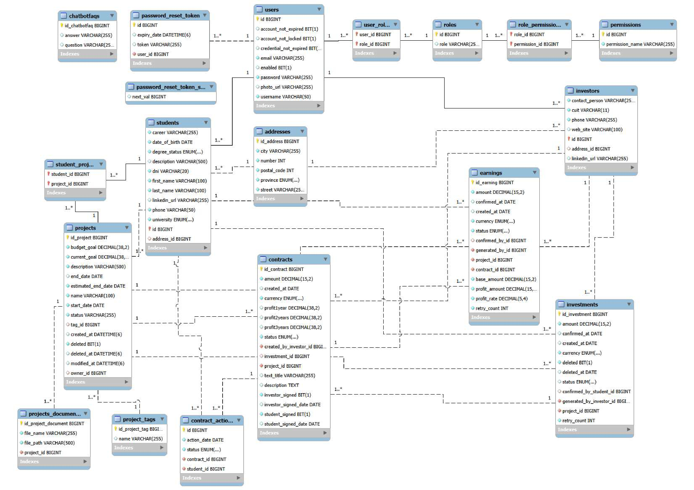

# 🤖 ProyPlus - Plataforma de Inversores (Fullstack App)

**ProyPlus** es una plataforma web fullstack (Spring Boot + Angular 19 + MySQL) diseñada para conectar a **estudiantes universitarios** con ideas innovadoras y a **inversores** que buscan potenciar el talento emergente. El sistema gestiona todo el ciclo de vida de un proyecto, desde su creación y financiación hasta la liquidación de ganancias, incorporando funcionalidades avanzadas de **Inteligencia Artificial** para el análisis de riesgos, la categorización automática de proyectos y el soporte al usuario mediante un chatbot inteligente.

---

## 📋 Documentación Funcional

Este proyecto incluye documentación funcional completa desarrollada bajo metodología Scrum:

- ✔️ Visual Story Mapping
- ✔️ Product Backlog con más de 35 historias de usuario y estimación en Story Points
- ✔️ Release Planning con sprints
- ✔️ Criterios de aceptación en formato BDD (Dado/Cuando/Entonces) para las 9 épicas del sistema
- ✔️ Plan de pruebas con más de 40 escenarios ejecutados
- ✔️ Seguimiento y registro de fallas
- ✔️ 4 Retrospectivas documentadas

📄 [Ver documentación completa](https://drive.google.com/file/d/1bcMB-g117ibh29tEvLWR5scpI_qBaEl6/view?usp=sharing)

---

## 💡 Decisiones de Diseño y Justificaciones Técnicas

Esta sección detalla las decisiones clave de arquitectura y tecnología tomadas durante el desarrollo del Frontend y Backend, demostrando un enfoque moderno, pragmático y orientado a resultados.

#### ¿Por qué Angular 19, Standalone Components y Signals en el Frontend?
Para la interfaz de usuario se seleccionó la última versión de **Angular (v19)** por sus notables ventajas de rendimiento y mantenibilidad:
- **Componentes Standalone (Sin NgModules)**: Simplifican radicalmente la arquitectura al eliminar los pesados módulos tradicionales. Cada componente es autosuficiente y declara explícitamente sus dependencias.
- **Estado Reactivo con Signals**: Se sustituyó el modelo tradicional de *Change Detection* por **Angular Signals**, logrando una actualización fina (*fine-grained*) del DOM únicamente cuando los datos cambian, optimizando el rendimiento y la fluidez visual.
- **Sintaxis Control Flow Moderna**: Se adoptó la nueva sintaxis declarativa (`@if`, `@for`, `@switch`), reduciendo la verbosidad de directivas estructurales antiguas (`*ngIf`, `*ngFor`) y mejorando la legibilidad de las plantillas.
- **Carga Diferida por Dominios (Lazy Loading)**: El enrutamiento se estructuró modularmente por dominios de negocio (`admin`, `auth`, `investors`, `projects`, `students`, `home`), descargando únicamente los paquetes JS necesarios bajo demanda.

#### ¿Por qué una Arquitectura Monolítica en Capas en el Backend?
Frente a una arquitectura de microservicios, se optó por un enfoque monolítico en capas por razones estratégicas:
- **Agilitar el Desarrollo**: Al tener una única base de código y un solo artefacto a desplegar, se redujo la complejidad operativa y se aceleró la implementación de nuevas funcionalidades.
- **Reducir la Complejidad Inicial**: Se evitaron los desafíos inherentes a los microservicios, como la comunicación entre servicios, el descubrimiento de servicios y la gestión de transacciones distribuidas.
- **Mantenibilidad Centralizada**: La estructura en capas (`controller`, `service`, `repository`) garantiza una separación de responsabilidades clara dentro del monolito, facilitando su mantenimiento y escalabilidad futura.

#### ¿Por qué JWT para la Seguridad?
La elección de **JSON Web Tokens (JWT)** para la gestión de sesiones fue deliberada para construir una API **stateless**:
- **Escalabilidad y Simplicidad**: Al no depender de una sesión en el servidor, la API puede escalar horizontalmente sin problemas.
- **Independencia del Cliente**: Permite que el frontend en Angular (o cualquier cliente móvil) interactúe con la API de forma estandarizada mediante la cabecera HTTP `Authorization: Bearer <token>`.

#### ¿Por qué combinar Weka y Google Gemini?
Se adoptó un enfoque híbrido de Inteligencia Artificial para resolver cada problema con la herramienta óptima:
- **Weka para Análisis de Riesgo**: Para evaluar el riesgo financiero de un contrato propuesta, se utilizó un modelo de Machine Learning clásico (**Random Forest**) entrenado sobre un dataset de 5,000 escenarios estructurados. La librería **Weka** integrada nativamente en Java ejecuta predicciones instantáneas y deterministas.
- **Google Gemini para Tareas de NLP**: Para el **etiquetado automático de proyectos** por categoría y el **chatbot conversacional (Proy+ Bot)**, se delegó la complejidad a **Google Gemini** mediante *prompt engineering* avanzado.

#### ¿Por me usar DTOs y el Patrón Mapper?
- **Desacoplamiento y Seguridad**: El uso de **Data Transfer Objects (DTOs)** y mappers con MapStruct crea una capa de abstracción entre la API y el modelo de datos interno, evitando exponer entidades JPA directamente.
- **Flexibilidad de la API**: Permite moldear la estructura exacta requerida por las pantallas del Frontend sin sobrecargar el tráfico de red.

---

## 🏛️ Arquitectura del Sistema


---

## 🛡️ Consideraciones de Seguridad

- **Autenticación y Autorización con Spring Security**: Control de acceso granular a través de tokens JWT.
- **Hashing de Contraseñas**: Encriptación estricta con algoritmo **BCrypt** (`BCryptPasswordEncoder`).
- **Protección a Nivel de Método**: Anotaciones `@PreAuthorize` para restringir endpoints según el rol del usuario (`ADMIN`, `STUDENT`, `INVESTOR`).
- **Validación de Datos**: Uso de `@Valid` en DTOs para prevenir datos inconsistentes.
- **Intercepción HTTP en Frontend**: El frontend adjunta el token JWT automáticamente en cada petición HTTP mediante un `HttpInterceptor` y gestiona el flujo de desautenticación en caso de token expirado (HTTP 401/403).

---

## ✨ Funcionalidades Destacadas con IA

### 1. Análisis de Riesgo de Inversión (Weka)
Evalúa propuestas de contratos utilizando el modelo de **Random Forest**, calculando el nivel de riesgo (`BAJO`, `MEDIO`, `ALTO`), porcentaje de confianza, proyecciones de ganancias a 3 años y desglose de factores de análisis.

### 2. Etiquetado Automático de Proyectos (Google Gemini)
Analiza la descripción ingresada por un estudiante al crear un proyecto y le asigna automáticamente la categoría más adecuada (ej. `TECNOLOGÍA`, `FINTECH`, `SALUD Y BIENESTAR`, `EDUCACIÓN`).

### 3. Chatbot de Soporte - Proy+ Bot (Google Gemini)
Asistente virtual inteligente que responde preguntas frecuentes y guía a los usuarios basándose en la base de conocimientos oficial de la plataforma.

---

## 🔄 Flujos de Negocio Detallados


### 1. Flujo de Creación y Financiación de un Proyecto
1. **Creación (Estudiante)**: Un estudiante registra un proyecto. La IA le asigna una etiqueta automáticamente (`PENDING_FUNDING`).
2. **Propuesta de Contrato (Inversor)**: Un inversor crea una propuesta (`DRAFT`).
3. **Negociación y Visto Bueno**: Ambas partes acuerdan términos y bloquean el contrato (`PARTIALLY_SIGNED`).
4. **Ratificación y Firma**: Ambas partes confirman digitalmente (`SIGNED`), creando automáticamente la inversión (`IN_PROGRESS`).
5. **Transferencia y Confirmación**: El inversor envía fondos fuera de la plataforma y el estudiante confirma su recepción (`RECEIVED`), actualizando el avance financiero.

### 2. Flujo de Cierre de Contrato y Generación de Ganancias
1. **Cierre de Contrato**: El estudiante cierra el contrato al completar el proyecto (`CLOSED`).
2. **Cálculo de Ganancias**: El sistema genera automáticamente el registro de ganancias (`Earning`).
3. **Pago y Confirmación**: El estudiante transfiere el retorno al inversor y este confirma la recepción (`RECEIVED`).

---

## 🗄️ Diagrama Entidad-Relación (DER)



---

## ⚙️ Cómo Ejecutar el Proyecto con Docker Compose

La forma recomendada y más sencilla de ejecutar toda la plataforma (Frontend, Backend y Base de Datos con datos iniciales) es utilizando **Docker Compose**.

### Requisitos Previos
- [Docker Desktop](https://www.docker.com/products/docker-desktop/) instalado y en ejecución.

### Comando Único de Despliegue

1️⃣ **Clonar el repositorio y levantar todos los servicios**:

```bash
git clone <URL-DEL-REPOSITORIO>
cd investor-platform-backend
docker compose up -d --build
```

Docker construirá e iniciará automáticamente:
- **Base de Datos MySQL 8.0**: Inicializa las tablas e inserta los permisos, roles (`STUDENT`, `INVESTOR`, `ADMIN`) y etiquetas iniciales mediante `docker-init/01-init.sql`.
- **Backend Spring Boot 3**: Compila el proyecto con Maven y levanta la API REST en Java 17.
- **Frontend Angular 19**: Instala las dependencias y sirve la aplicación web responsiva.

---

### 🌐 Servicios Disponibles

| Servicio | URL / Puerto | Descripción |
| :--- | :--- | :--- |
| **Frontend Web** | `http://localhost:4200` | Interfaz de Usuario (Angular 19) |
| **Backend REST API** | `http://localhost:8080` | API REST (Spring Boot 3) |
| **Base de Datos** | `localhost:3307` | MySQL 8.0 (Mapeado a puerto host `3307`) |

---

### 🛠️ Comandos Útiles de Docker

* **Ver estado de los contenedores**: `docker compose ps`
* **Ver logs del Backend**: `docker logs proyplus-backend -f`
* **Ver logs del Frontend**: `docker logs proyplus-frontend -f`
* **Detener la aplicación**: `docker compose down`

---

## 📁 Estructura del Proyecto

```text
investor-platform-backend/
├── 📁 backend/                # Código fuente del Backend (Spring Boot 3)
│   ├── Dockerfile             # Multi-stage Dockerfile para Maven & JDK 17
│   ├── pom.xml                # Dependencias Maven (Spring Boot, Weka, MapStruct, MySQL)
│   └── src/main/java/com/example/gestor_inversores/
│       ├── config/            # Configuraciones globales (Security, Gemini, CORS)
│       ├── controller/        # Controladores REST por Dominio
│       ├── dto/               # Data Transfer Objects
│       ├── model/             # Entidades JPA y Enums de Dominio
│       ├── repository/        # Repositorios Spring Data JPA
│       ├── security/          # Filtros JWT y UserDetailsService
│       ├── service/           # Lógica de Negocio, Weka IA y Gemini NLP
│       └── exception/         # Manejo centralizado de Excepciones
│
├── 📁 front/                  # Código fuente del Frontend (Angular 19)
│   ├── Dockerfile             # Multi-stage Dockerfile para Angular
│   ├── package.json           # Dependencias del proyecto (Angular CLI, RxJS, Chart.js)
│   └── src/app/
│       ├── admin/             # Módulo de Administración (Dashboard y Permisos)
│       ├── auth/              # Módulo de Autenticación (Login, Registro, Password Reset)
│       ├── home/              # Landing page pública y noticias
│       ├── investors/         # Pánel de Inversores y Detalles de Inversión
│       ├── projects/          # Catálogo de Proyectos, Contratos e IA de Riesgo
│       ├── students/          # Pánel de Estudiantes
│       ├── core/              # Interceptores JWT y Servicios globales
│       ├── layout/            # Shell principal (Navbar, Sidebar responsivo)
│       └── shared/            # Componentes reutilizables (Chatbot IA, Legal, Pipes)
│
├── 📁 docker-init/            # Scripts SQL de inicialización para MySQL
│   └── 01-init.sql            # Creación de esquemas y seeding inicial
├── docker-compose.yml         # Orquestación de contenedores (MySQL, Backend, Frontend)
└── README.md                  # Documentación del proyecto
```

---

## 🔗 Endpoints de la API

### 🔐 Autenticación (`/auth`)

| Método | Endpoint | Descripción | Acceso |
| :---: | :--- | :--- | :--- |
| `POST` | `/auth/login` | Inicia sesión y obtiene un token JWT | Público |
| `POST` | `/auth/forgot-password` | Inicia el proceso de reseteo de contraseña | Público |
| `POST` | `/auth/reset-password` | Resetea la contraseña utilizando un token enviado por email | Público |

### 💼 Inversores (`/api/investors`)

| Método | Endpoint | Descripción | Acceso |
| :---: | :--- | :--- | :--- |
| `GET` | `/api/investors` | Lista todos los inversores registrados | `ADMIN` |
| `GET` | `/api/investors/{id}` | Obtiene el perfil completo de un inversor por ID | `INVESTOR`, `ADMIN` |
| `POST` | `/api/investors` | Registra un nuevo perfil de inversor | Público |
| `PUT` | `/api/investors/update-by-admin/{id}` | Actualiza datos de un inversor | `ADMIN` |
| `PATCH` | `/api/investors/{id}` | Actualiza parcialmente el propio perfil | `INVESTOR` |
| `PATCH` | `/api/investors/activate/{id}` | Activa el estado de un inversor | `INVESTOR`, `ADMIN` |
| `PATCH` | `/api/investors/desactivate/{id}` | Desactiva el estado de un inversor | `INVESTOR`, `ADMIN` |
| `GET` | `/api/investors/check-cuit/{cuit}` | Verifica la disponibilidad de un CUIT | Público |

### 🎓 Estudiantes (`/api/students`)

| Método | Endpoint | Descripción | Acceso |
| :---: | :--- | :--- | :--- |
| `GET` | `/api/students` | Lista todos los estudiantes registrados | `ADMIN` |
| `GET` | `/api/students/{id}` | Obtiene un estudiante por ID | `STUDENT`, `ADMIN` |
| `GET` | `/api/students/projects/{id}` | Obtiene los proyectos pertenecientes a un estudiante | `STUDENT`, `ADMIN` |
| `GET` | `/api/students/names` | Obtiene el listado de nombres de estudiantes | `STUDENT` |
| `POST` | `/api/students` | Registra un nuevo estudiante | Público |
| `PUT` | `/api/students/update-by-admin/{id}` | Actualiza la información de un estudiante | `ADMIN` |
| `PATCH` | `/api/students/{id}` | Actualiza parcialmente el propio perfil | `STUDENT` |
| `PATCH` | `/api/students/activate/{id}` | Activa la cuenta de un estudiante | `ADMIN` |
| `PATCH` | `/api/students/desactivate/{id}` | Desactiva la cuenta de un estudiante | `STUDENT`, `ADMIN` |
| `GET` | `/api/students/by-username` | Obtiene datos de estudiante mediante username | `STUDENT`, `INVESTOR`, `ADMIN` |
| `GET` | `/api/students/check-username/{username}` | Verifica disponibilidad de un nombre de usuario | Público |
| `GET` | `/api/students/check-email/{email}` | Verifica disponibilidad de un email | Público |
| `GET` | `/api/students/check-dni/{dni}` | Verifica disponibilidad de un DNI | Público |

### 🚀 Proyectos (`/api/projects`)

| Método | Endpoint | Descripción | Acceso |
| :---: | :--- | :--- | :--- |
| `POST` | `/api/projects` | Registra un nuevo proyecto (etiquetado automático por IA) | `STUDENT` |
| `GET` | `/api/projects` | Lista el catálogo general de proyectos | `STUDENT`, `INVESTOR`, `ADMIN` |
| `GET` | `/api/projects/{id}` | Obtiene la información detallada de un proyecto | `STUDENT`, `INVESTOR`, `ADMIN` |
| `GET` | `/api/projects/{id}/students` | Obtiene el equipo de estudiantes asignado a un proyecto | `STUDENT`, `INVESTOR`, `ADMIN` |
| `GET` | `/api/projects/by-owner/{ownerId}` | Lista los proyectos creados por un estudiante específico | `STUDENT`, `ADMIN` |
| `GET` | `/api/projects/tag/{tag}` | Filtra los proyectos según su etiqueta temática | `STUDENT`, `INVESTOR`, `ADMIN` |
| `GET` | `/api/projects/by-investment/{investorId}` | Lista proyectos donde ha participado un inversor | `INVESTOR`, `ADMIN` |
| `GET` | `/api/projects/dashboard-admin/projects` | Obtiene métricas globales para el panel de administración | `ADMIN` |
| `PUT` | `/api/projects/{id}` | Actualiza los datos de un proyecto | `STUDENT`, `ADMIN` |
| `PUT` | `/api/projects/activate/{id}` | Activa manualmente un proyecto en revisión | `ADMIN` |
| `PUT` | `/api/projects/complete/{projectId}` | Marca un proyecto finalizado exitosamente | `STUDENT` |
| `PUT` | `/api/projects/cancel/{id}` | Cancela un proyecto en curso | `STUDENT` |
| `POST` | `/api/projects/{projectId}/contact` | Envía un mensaje directo al fundador del proyecto | `INVESTOR` |
| `DELETE` | `/api/projects/{id}` | Elimina un proyecto de la base de datos | `ADMIN` |

### 📄 Contratos (`/api/contracts`)

| Método | Endpoint | Descripción | Acceso |
| :---: | :--- | :--- | :--- |
| `POST` | `/api/contracts` | Crea una propuesta de contrato inicial (`DRAFT`) | `INVESTOR` |
| `PUT` | `/api/contracts/update-by-investor/{id}` | Modifica los términos propuestos por el inversor | `INVESTOR` |
| `PUT` | `/api/contracts/update-by-student/{id}` | Modifica la contrapropuesta enviada por el estudiante | `STUDENT` |
| `PUT` | `/api/contracts/agree-by-student/{id}` | Otorga visto bueno al contrato (`PARTIALLY_SIGNED`) | `STUDENT` |
| `PUT` | `/api/contracts/agree-by-investor/{id}` | Otorga visto bueno al contrato (`PARTIALLY_SIGNED`) | `INVESTOR` |
| `PUT` | `/api/contracts/sign-by-student/{id}` | Firma y ratifica formalmente el contrato | `STUDENT` |
| `PUT` | `/api/contracts/sign-by-investor/{id}` | Firma y ratifica formalmente el contrato (`SIGNED`) | `INVESTOR` |
| `PUT` | `/api/contracts/close/{id}` | Cierra el contrato al completar el proyecto (`CLOSED`) | `STUDENT` |
| `PUT` | `/api/contracts/cancel-by-student/{id}` | Cancela el proceso de contratación | `STUDENT` |
| `PUT` | `/api/contracts/cancel-by-investor/{id}` | Cancela la propuesta de contrato | `INVESTOR` |
| `PUT` | `/api/contracts/refund/{id}` | Inicia el proceso de devolución de inversión | `STUDENT` |
| `GET` | `/api/contracts/by-project/{projectId}` | Lista contratos asociados a un proyecto | `STUDENT` |
| `GET` | `/api/contracts/by-investor/{investorId}` | Lista contratos iniciados por un inversor | `INVESTOR` |
| `GET` | `/api/contracts/by-owner/{studentId}` | Lista contratos recibidos por un estudiante | `STUDENT` |
| `GET` | `/api/contracts/investor/{investorId}/project/{projectId}` | Busca la propuesta específica entre partes | `INVESTOR` |
| `GET` | `/api/contracts/exists` | Verifica si ya existe un acuerdo activo | `STUDENT`, `INVESTOR` |

### 💰 Inversiones (`/api/investments`)

| Método | Endpoint | Descripción | Acceso |
| :---: | :--- | :--- | :--- |
| `GET` | `/api/investments` | Lista todas las inversiones registradas | `STUDENT`, `INVESTOR`, `ADMIN` |
| `GET` | `/api/investments/{id}` | Obtiene el detalle de una inversión por ID | `STUDENT`, `INVESTOR`, `ADMIN` |
| `GET` | `/api/investments/actives` | Obtiene el listado de inversiones activas | `STUDENT`, `INVESTOR`, `ADMIN` |
| `GET` | `/api/investments/investments-by-project/{projectId}` | Obtiene inversiones recibidas por un proyecto | `STUDENT`, `INVESTOR`, `ADMIN` |
| `GET` | `/api/investments/by-investor/{investorId}` | Obtiene el historial de aportes de un inversor | `STUDENT`, `INVESTOR`, `ADMIN` |
| `PUT` | `/api/investments/confirm-payment-sent/{id}` | Notifica la transferencia realizada por el inversor | `INVESTOR` |
| `PUT` | `/api/investments/confirm-receipt/{id}` | Confirma la acreditación bancaria recibida | `STUDENT` |
| `PUT` | `/api/investments/mark-not-received/{id}` | Notifica un imprevisto en la acreditación del pago | `STUDENT` |
| `PUT` | `/api/investments/reject-overfunded/{id}` | Rechaza la inversión por superación del presupuesto | `STUDENT` |
| `PUT` | `/api/investments/confirm-refund-sent/{id}` | Confirma el envío del reembolso al inversor | `STUDENT` |
| `PUT` | `/api/investments/confirm-refund/{id}` | Confirma la recepción del reembolso enviado | `INVESTOR` |
| `PUT` | `/api/investments/mark-refund-not-received/{id}` | Marca reembolso como pendiente de acreditación | `INVESTOR` |
| `PUT` | `/api/investments/cancel/{id}` | Solicita la cancelación formal de la inversión | `INVESTOR` |
| `DELETE` | `/api/investments/{id}` | Remueve un registro de inversión | `ADMIN` |

### 📈 Ganancias (`/api/earnings`)

| Método | Endpoint | Descripción | Acceso |
| :---: | :--- | :--- | :--- |
| `GET` | `/api/earnings` | Lista todas las liquidaciones de retorno generadas | `ADMIN` |
| `GET` | `/api/earnings/summary` | Genera un reporte consolidador de rendimientos | `ADMIN` |
| `GET` | `/api/earnings/project/{projectId}` | Obtiene las ganancias liquidadas de un proyecto | `STUDENT`, `INVESTOR`, `ADMIN` |
| `GET` | `/api/earnings/investor/{investorId}` | Lista las ganancias obtenidas por un inversor | `INVESTOR`, `ADMIN` |
| `GET` | `/api/earnings/student/{studentId}` | Lista los retornos liquidados por un estudiante | `STUDENT`, `ADMIN` |
| `GET` | `/api/earnings/by-project/{projectId}` | Desglosa los retornos por identificador de proyecto | `STUDENT`, `INVESTOR`, `ADMIN` |
| `GET` | `/api/earnings/by-contract/{contractId}` | Muestra el retorno calculado asociado a un contrato | `STUDENT`, `INVESTOR`, `ADMIN` |
| `PUT` | `/api/earnings/confirm-payment-sent/{id}` | Notifica la transferencia de ganancia al inversor | `STUDENT` |
| `PUT` | `/api/earnings/confirm-receipt/{id}` | Confirma la recepción conforme de la ganancia | `INVESTOR` |
| `PUT` | `/api/earnings/mark-not-received/{id}` | Reporta discrepancias en la acreditación del retorno | `INVESTOR` |

### 🧠 Inteligencia Artificial y Chatbot (`/api/analysis`, `/api/chatbot`)

| Método | Endpoint | Descripción | Acceso |
| :---: | :--- | :--- | :--- |
| `POST` | `/api/analysis/risk` | Ejecuta la predicción de riesgo mediante **Weka Random Forest** | `INVESTOR` |
| `POST` | `/api/chatbot` | Procesa consultas conversacionales usando **Google Gemini NLP** | Autenticado / Público |

### 📎 Documentos de Proyecto (`/api/project-documents`)

| Método | Endpoint | Descripción | Acceso |
| :---: | :--- | :--- | :--- |
| `POST` | `/api/project-documents/upload` | Adjunta un documento en formato PDF/imagen al proyecto | `STUDENT`, `ADMIN` |
| `GET` | `/api/project-documents/project/{projectId}` | Lista los archivos adjuntos vinculados a un proyecto | `STUDENT`, `INVESTOR`, `ADMIN` |
| `GET` | `/api/project-documents/download/{id}` | Descarga un documento almacenado | `STUDENT`, `INVESTOR`, `ADMIN` |
| `DELETE` | `/api/project-documents/{id}` | Elimina un archivo adjunto del servidor | `STUDENT`, `ADMIN` |

### 💱 Conversión de Divisas (`/api/currency`)

| Método | Endpoint | Descripción | Acceso |
| :---: | :--- | :--- | :--- |
| `GET` | `/api/currency/convert` | Consulta cotizaciones y convierte montos en tiempo real (ARS, USD, EUR, CNY) | Autenticado |

### 🛡️ Usuarios, Roles y Permisos (`/api/users`, `/api/roles`, `/api/permissions`)

| Método | Endpoint | Descripción | Acceso |
| :---: | :--- | :--- | :--- |
| `GET` | `/api/users` | Lista todos los usuarios de la plataforma | `ADMIN` |
| `GET` | `/api/users/{id}` | Obtiene los detalles de un usuario específico | `ADMIN` |
| `POST` | `/api/users` | Crea un usuario con credenciales de administración | `ADMIN` |
| `PATCH` | `/api/users/{id}` | Modifica datos de un usuario | `ADMIN` |
| `PATCH` | `/api/users/activate/{id}` | Habilita el acceso a un usuario deshabilitado | `ADMIN` |
| `PATCH` | `/api/users/desactivate/{id}` | Inhabilita temporalmente a un usuario | `ADMIN` |
| `GET` | `/api/roles` | Lista los roles registrados (`STUDENT`, `INVESTOR`, `ADMIN`) | `ADMIN` |
| `GET` | `/api/roles/{id}` | Obtiene la configuración de un rol | `ADMIN` |
| `POST` | `/api/roles` | Crea una nueva entidad de rol | `ADMIN` |
| `PATCH` | `/api/roles/{id}` | Actualiza la matriz de permisos asignada a un rol | `ADMIN` |
| `DELETE` | `/api/roles/{id}` | Elimina un rol existente | `ADMIN` |
| `GET` | `/api/permissions` | Lista los permisos del sistema (`CREATE`, `READ`, `UPDATE`, `DELETE`) | `ADMIN` |
| `GET` | `/api/permissions/{id}` | Obtiene un permiso por ID | `ADMIN` |
| `POST` | `/api/permissions` | Registra un nuevo permiso | `ADMIN` |
| `PUT` | `/api/permissions/{id}` | Modifica la definición de un permiso | `ADMIN` |
| `DELETE` | `/api/permissions/{id}` | Elimina un permiso | `ADMIN` |

---

## 👨‍🎓 Autores y Contexto Académico

### Equipo de Desarrollo
- David Texeira
- Federico Perez Krohn
- Ivan Mollari
- Maximiliano Ortiz
- Lucas Beron Von Brand

Este proyecto fue desarrollado como el **Trabajo Práctico Final** para la materia "Proyecto Final" de la **Licenciatura en Gestión de Tecnología** en la **Universidad Nacional de La Matanza (UNLaM)**.
